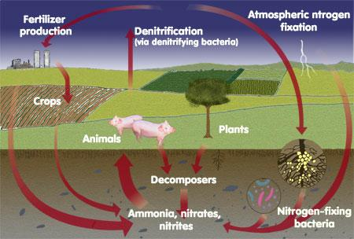

### Theory

<h2>Introduction:</h2>

  A soil analysis is a process by which elements such as P, K, Ca, Mg, Na, S, Mn, Cu and Zn are chemically extracted from the soil and measured for their “plant available” content within the soil sample.

  

 

<h2>Significance of Soil Analysis:</h2>
<ul>
  <li>It increases the knowledge of what nutrients are especially available in our soil.</li>
  <li>It reduces the environmental impacts due to soil amendments.</li>
  <li>It increases the efficiency of resource inputs such as fertilisers and water.</li>
  <li>It helps to predict the nutritional values needed for crop production.</li>
  <li>It helps to evaluate the fertility status of soils of a country or a state or a district.</li>
</ul>

<h2>Procedure for Taking Good Soil Samples:</h2>
<ol>
  <li>Determine the soil unit (or plot).</li>
  <li>Make a traverse over the soil unit (or plot).</li>
  <li>Clean the site (with spade) from where soil sample is to be collected.</li>
  <li>Insert the spade into soil.</li>
  <li>Standing on the opposite side, again insert the spade into soil.</li>
  <li>A lump of soil is removed.</li>
  <li>A pit of ‘V’ shape is formed. Its depth should be 0-6" or 0-9" or 0-12" (i.e., Depth of tillage).</li>
  <li>Take out the soil-slice (like a bread slice) of ½ inch thick from both the exposed surface of the pit from top to bottom. This slice is also termed furrow-slice. To collect the soil-slice spade may be used. Collect the soil samples in a polyethylene bucket.</li>
  <li>Collect furrow-slices from 8-10 or sometimes 20-30 sites. Select the sites at random in a zigzag (or criss-cross) manner. Distribute the sites throughout the entire soil unit (plot). In lieu of spade auger may be used. Do not take the prohibited samples and local problem soils.</li>
  <li>Furnish the following information in two sheets of thick paper with the sample. One sheet is folded and kept inside the bag. Another sheet is folded and attached to the bag.</li>
</ol>

<h2>Available Nitrogen Content in Soil:</h2>

  Nitrogen is one of the major elements required for life. It will stimulate above ground growth, and produces the rich green colour that is the characteristic of healthy plants, because of this Nitrogen is essential for plant life.

  78% of the atmosphere is covered by molecular Nitrogen (N₂); this form of Nitrogen cannot be used by animals. This molecular Nitrogen must first combine with Oxygen or Hydrogen to produce compounds such as Ammonia or Nitrate, or some other organic form of Nitrogen. This is called Nitrogen Fixation.

  Some Nitrogen Fixation occurs by lightning and some other by blue green algae. However, the bulk of Nitrogen Fixation is preferred by bacteria living in the soil. Some of the Nitrogen Fixation bacteria were living free in the soil, while the others were living within the root nodules of some plants such as soya bean, peanut, beans, clover, alfalfa, etc.

  Because Ammonia or Ammonium is produced by the decomposition process, the decomposition of materials in the forest is also a source of Nitrogen. The movement of Nitrogen from the atmosphere into inorganic forms, followed by the incorporation of Nitrogen into plant matter is represented as the Nitrogen Cycle.

Figure 1: Arrangement of two 

  The rate of plant growth is proportional to the rate of nitrogen supply. If the soil is deficient in Nitrogen, the plants become stunted and pale. However, an excess of Nitrogen can damage the plants just as over-fertilizing the lawn can burn and damage the grass.

<h2>Principle:</h2>

  The Kjeldahl method permits the available nitrogen to be precisely determined in the plant and in the soil. The method of determination involves three successive phases which are:

<ul>
  <li>Digestion of the organic material to convert nitrogen into HNO3.</li>
  <li>Distillation of the released Ammonia into an absorbing surface or medium.</li>
  <li>Volumetric analysis of the Ammonia formed during the digestion process.</li>
</ul>

<h3>Digestion:</h3>

  Digestion of the organic material is carried out by digesting the sample with concentrated H2SO4 in the presence of CuSO4·H2O as a catalyst and K2SO4, which raises the digestion temperature. The organic material decomposes into several components:

  C → CO2, O → H2O, and N → NH3

  In the organic matter, some nitrates are present, most of which are lost during the digestion. The loss may be disregarded for most soils, since the amount of NO3-–N is far less than the organic nitrogen.

  2 C6H3(OH)NH2COO + 26 H2SO4 → (NH4)2SO4 + 25 SO2 + 14 CO2 + 28 H2O

<h3>Distillation:</h3>

  The ammonia content of the digest is determined by distillation with excess NaOH and absorption of the evolved NH3 in standard HCl.

  (NH4)2SO4 + 2 NaOH → Na2SO4 + 2 NH3 + 2 H2O

  NH3 + HCl → NH4Cl

<h3>Volumetric Analysis:</h3>

  The excess of standard HCl is titrated against standard NaOH using methyl red as an indicator. The decrease in the acid equivalents determined by acid-base titration gives a measure of the nitrogen content of the sample. The end point is determined by a color change from pink to yellow.

  2 HCl + 2 NaOH → 2 NaCl + H2O

<h2>Significance:</h2>

  The chemical analysis of the soil for nitrogen is less precise when the requirement for this element needs to be forecast over a longer period of time, as they vary not only with species but with the phase of growth and season as well.

  Therefore, the chemical test for NO3- and NH4+ signifies the momentary status when the sample is taken, and measures must be taken instantaneously. The analysis of the extractable nitrogen content of the soil using a given extractable method in response to crop response studies provides a basis for nitrogen fertility levels.

  This helps rationalize the use efficiency of nitrogen fertilizer. Nitrogen content of the soil is also needed for evaluating C-N ratios of soils, which indicate the transformation process of organic nitrogen to available nitrogen like ammoniated or nitrate nitrogen.

